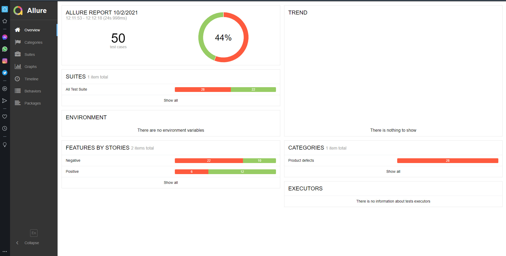

#### A demo API Automation project to test [ReqRes](https://reqres.in/) using [REST Assured](https://mvnrepository.com/artifact/io.rest-assured/rest-assured)

with using **TestNG** and **Allure Report**

### The used Plugins:
* [REST Assured](https://mvnrepository.com/artifact/io.rest-assured/rest-assured)
* [TestNG](https://mvnrepository.com/artifact/org.testng/testng)
* [Allure Report](https://mvnrepository.com/artifact/io.qameta.allure/allure-testng)
* [JSON Simple](https://mvnrepository.com/artifact/com.googlecode.json-simple/json-simple)